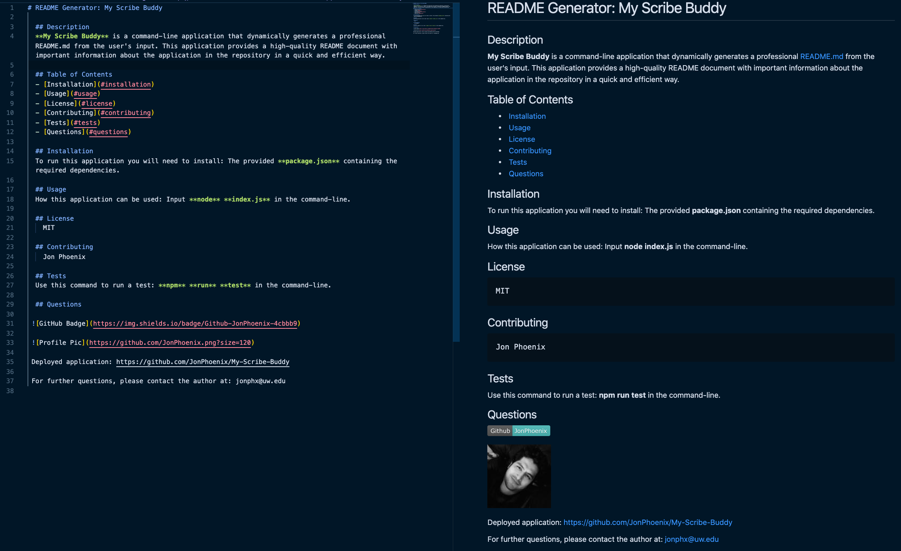
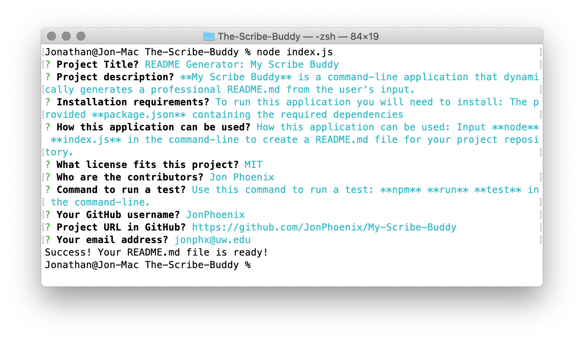
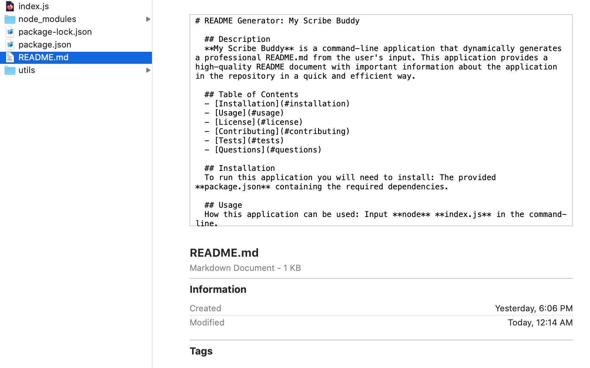

# README Generator: My Scribe Buddy

  ## Description
  **My Scribe Buddy** is a command-line application that dynamically generates a professional **README** file from the user's input. This application provides a high-quality README document with important information about the application in the repository in a quick and efficient way.

  **My Scribe Buddy** has been created with **JavaScript**, **Node.js** and **ES6+**, using the standard library package **fs (file system)**, and installing the [**Inquirer** package](https://www.npmjs.com/package/inquirer) as a dependency.

  Step-by-step instructions, demos and all the information needed to use this app can be found in the **Table of Contents** here below. This command-line application will run in Terminal (Mac), Git Bash (Windows), and VSCode (Mac & Windows). The final **README** file will look similar to this example:


  
  

  ## Table of Contents
  - [Installation](#installation)
  - [Usage](#usage)
  - [License](#license)
  - [Contributing](#contributing)
  - [Tests](#tests)
  - [Questions](#questions)

  ## Installation
  To run this application you will need to install: The provided **package.json** containing the required dependencies.

  ## Usage
  How this application can be used: Input **node** **index.js** in the command-line.

  The user will be prompted for information about their application repository, **My Scribe Buddy** will then generate a README file with the project's Title, and sections entitled Description, Table of Contents, Installation, Usage, License, Contributing, Tests, and Questions.

  The following **walk-through demo** shows the app functionality:

  

  When the application finished, the command-line interface (CLI) will look similar to this preview:

  

  Once the new **README** file is successfully created, it will be placed in the current working directory, in a similar way to this example:

  

  ## License
    MIT

  ## Contributing
    Jon Phoenix

  ## Tests
  Use this command to run a test: **npm** **run** **test** in the Command-Line Interface.

  ## Questions
  
 
  
 
  
 Deployed application: https://github.com/JonPhoenix/My-Scribe-Buddy
  
 For further questions, please contact the author at: jonphx@uw.edu

  ## References
  ```
  * openweathermap.org
  * w3schools.com
  * developer.mozilla.org

  * nodejs.org
  * node.readthedocs.io
  * npmjs.com

  * freecodecamp.org
  * shields.io
  * choosealicense.com
  * screencastify.com

```